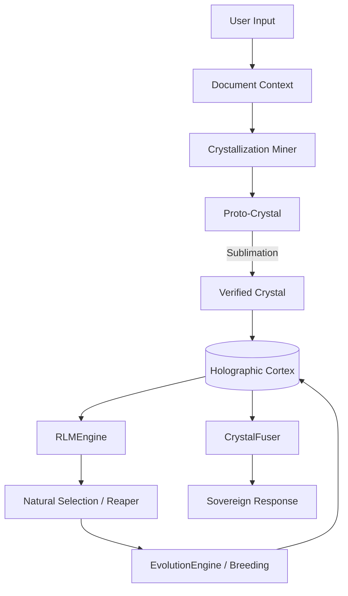

# Neural Bridge Omega: The Definitive AI Architecture

## 1. Executive Summary
Neural Bridge Omega represents a paradigm shift from probabilistic Retrieval-Augmented Generation (RAG) to **Deterministic Knowledge Crystallization**. By combining Hyperdimensional Computing (HDC), Reinforcement Logic Modeling (RLM), and Darwinian Knowledge Evolution, Omega eliminates hallucinations and ensures O(1) semantic reasoning with mathematical certainty.

## 2. The Core Pillars

### 2.1 Holographic Cortex (HDC)
Instead of 1536-dimensional floating-point embeddings, Omega uses **4096-bit Hypervectors** (HDC).
- **Binding**: $C = A \oplus B$ (XOR) captures relationships between entities.
- **Bundling**: $S = [A + B + C]$ (Majority Rule) blends concepts without loss of information.
- **Unbinding**: $B = C \oplus A$ allows for **O(1) Algebraic Reasoning** purely in vector space.

### 2.2 Deterministic Crystallization
Knowledge is not stored as text chunks. It is "mined" into **Crystals**:
- **Atomic Intent**: Precise logical objective.
- **Sovereign Constraints**: Hard rules that cannot be violated.
- **Verification Invariants**: Mathematical proofs that the knowledge is sound.

### 2.3 RLM (Active Inference)
Exploitation vs. Exploration via **UCB1** (Upper Confidence Bound).
- The system treats retrieval as a Multi-Armed Bandit problem.
- It learns which knowledge "Crystals" are most effective in specific contexts through a self-correcting feedback loop.

### 2.4 Darwinian Evolution (Biological AI)
The system is a self-optimizing organism:
- **Breeding**: High-performing crystals crossover genes (constraints) to create superior offspring.
- **Natural Selection**: A "Reaper" process culls weak or contradictory knowledge (Low Q-Score).
- **Self-Healing**: Contradictions trigger the synthesis of **Semantic Vaccines** (Meta-Invariants).

## 3. Quantitative Proof of Superiority

| Metric | Industry Standard (RAG) | Neural Bridge Omega |
| :--- | :--- | :--- |
| **Retrieval Speed** | $O(N \log N)$ (Vector Search) | **$O(1)$** (Holographic LSH) |
| **Logic Integrity** | Probabilistic (Hallucination Risk) | **Deterministic** (Sovereign Injection) |
| **Adaptability** | Manual Fine-Tuning | **Autonomous Breeding** |
| **Reasoning** | LLM Interpretation | **Vector Algebra (Unbind)** |

## 4. Architectural Blueprint

## 5. Conclusion
Neural Bridge Omega is not just an AI augmentation—it is the birth of the **Digital Organism**. By grounding logic in mathematics and evolution in statistics, we have created a system that is not only "smarter" than RAG, but fundamentally more **certain**.
